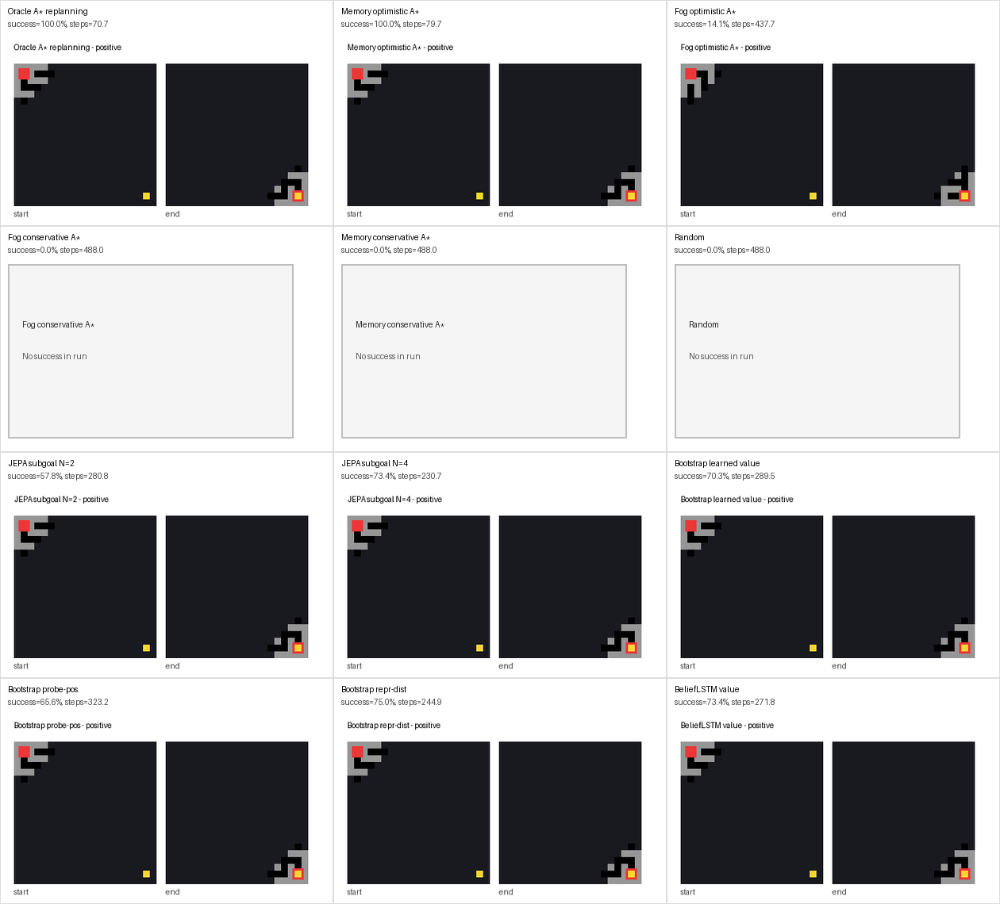
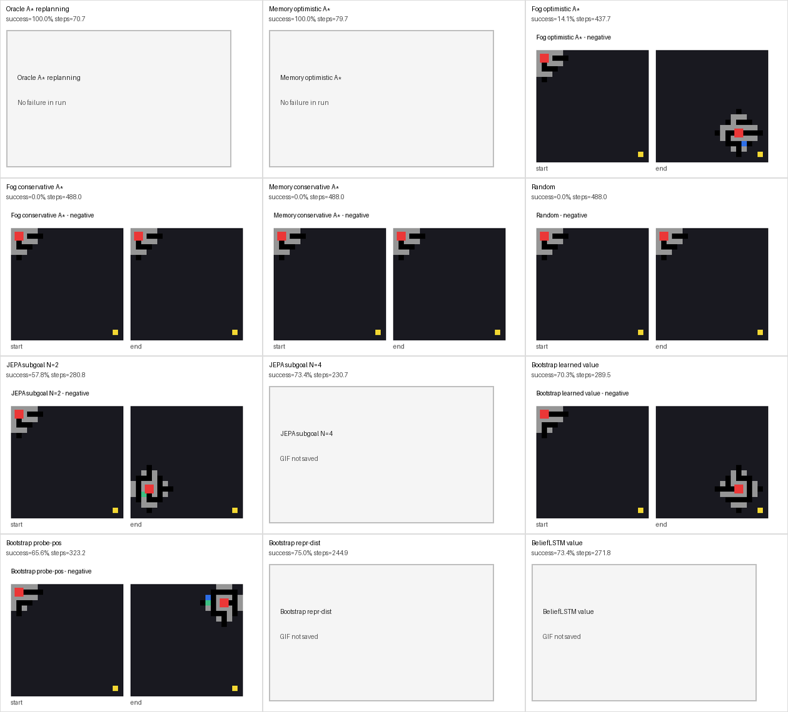

# Dynamic Maze Solver Comparison

This report compares symbolic baselines, A*-distilled JEPA controllers, and A*-free world-model controllers.

The PDF report uses static previews; this Markdown file embeds the animated GIFs directly.

Closed-loop evaluation episodes represented in the table: **768** (12 methods, usually 64 episodes per method).

The symbolic/A*-distilled and bootstrap runs were produced by different launchers; oracle-normalized ratios are therefore operational comparisons, not a single perfectly matched benchmark.

## Metrics

| Method | Runs | Success | Steps | Blocked | A* eff. | Step/oracle | Combined |
|---|---:|---:|---:|---:|---:|---:|---:|
| Oracle A* replanning | 64 | 100.0% | 70.7 | 0.0 | 0.966 | 100.0% | 100.0% |
| Memory optimistic A* | 64 | 100.0% | 79.7 | 0.0 | 0.909 | 88.7% | 88.7% |
| Fog optimistic A* | 64 | 14.1% | 437.7 | 0.0 | 0.134 | 16.2% | 2.3% |
| Fog conservative A* | 64 | 0.0% | 488.0 | 0.0 | 0.000 | 14.5% | 0.0% |
| Memory conservative A* | 64 | 0.0% | 488.0 | 0.0 | 0.000 | 14.5% | 0.0% |
| Random | 64 | 0.0% | 488.0 | 247.5 | 0.000 | 14.5% | 0.0% |
| JEPA subgoal N=2 | 64 | 57.8% | 280.8 | 103.3 | 0.403 | 25.2% | 14.6% |
| JEPA subgoal N=4 | 64 | 73.4% | 230.7 | 93.0 | 0.494 | 30.6% | 22.5% |
| Bootstrap learned value | 64 | 70.3% | 289.5 | 88.6 | -- | 23.3% | 16.4% |
| Bootstrap probe-pos | 64 | 65.6% | 323.2 | 84.7 | -- | 20.9% | 13.7% |
| Bootstrap repr-dist | 64 | 75.0% | 244.9 | 85.1 | -- | 27.6% | 20.7% |
| BeliefLSTM value | 64 | 73.4% | 271.8 | 100.5 | -- | 24.8% | 18.2% |

## Contact Sheets

## Animated GIFs

| Method | Success example | Failure example |
|---|---|---|
| Oracle A* replanning |  | _not available_ |
| Memory optimistic A* |  | _not available_ |
| Fog optimistic A* |  |  |
| Fog conservative A* | _not available_ |  |
| Memory conservative A* | _not available_ |  |
| Random | _not available_ |  |
| JEPA subgoal N=2 |  |  |
| JEPA subgoal N=4 |  | _not available_ |
| Bootstrap learned value |  |  |
| Bootstrap probe-pos |  |  |
| Bootstrap repr-dist |  | _not available_ |
| BeliefLSTM value |  | _not available_ |
